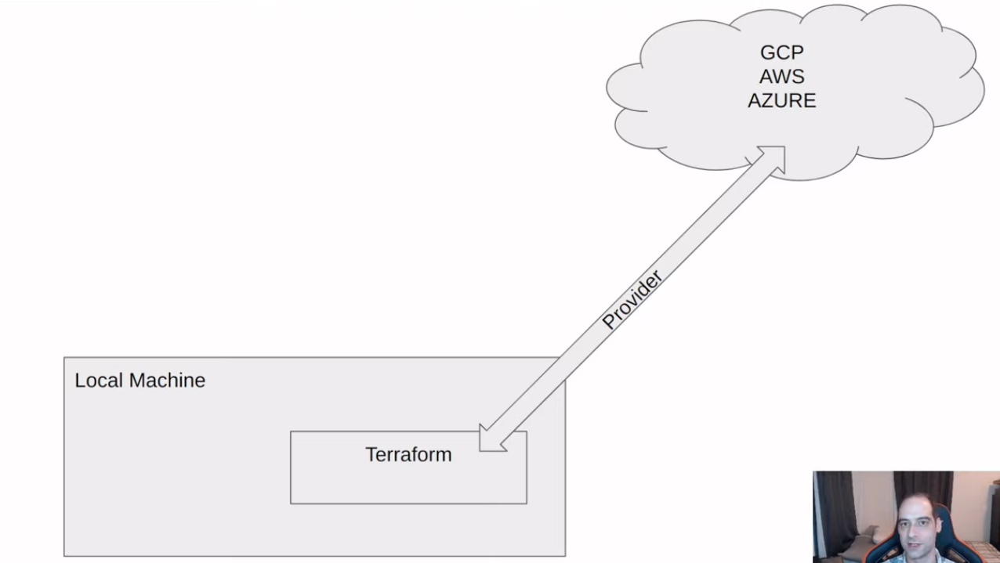
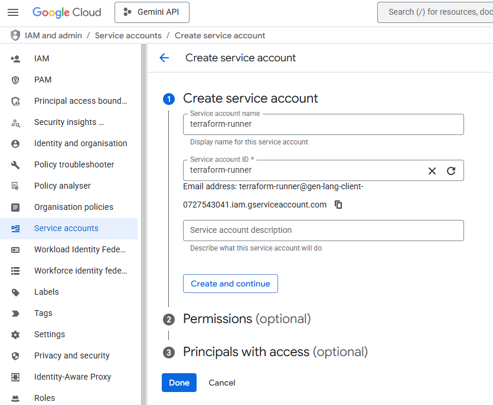
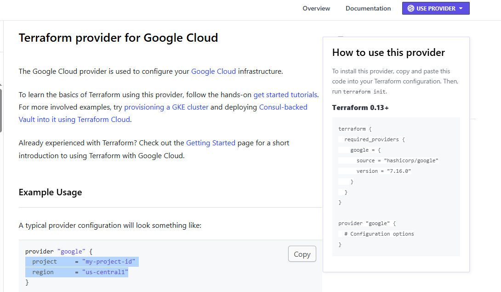

# What is Terraform

- Infrastructure as code, allows us to define and provision data center infrastructure using a high-level configuration language.



## Key Terraform Commands

- Init - Get me the providers I need
- Plan - What am I about to do?
- Apply - Do what is in the tf files
- Destroy - Remove everything defined in the tf files

## Creating a Service Account

Let's create a service account with permissions to specific resources:

- Storage Admin
- Bigquery Admin
- Compute Admin




Let's suppose we forgot to add compute engine, we can always go to the IAM section and add the permission:


Now we need to access the service account we created, for that we need to create a key in json format


Save the credentials in a file (e.g., `keys/my-creds.json`) and add `keys/` to `.gitignore` so we don't push it to GitHub.

## Terraform Provider Configuration

Now let's look for Terraform providers for Google Cloud for the typical snippet of code:



if you do not have terraform install in your system please follow the instructions here: https://developer.hashicorp.com/terraform/install

Then verify the installation

```bash
terraform -v
```

Also you can use `terraform fmt` to format your tf files:

```bash
terraform fmt
```

Now you need to go to the Google Cloud Console, fetch the project ID and region where you want to create resources, and add them to the `main.tf` file.

## Setting Up Credentials

Now we need to set the environment variable to point to the credentials file we downloaded before:

```bash
export GOOGLE_APPLICATION_CREDENTIALS="$PWD/keys/my-creds.json"
echo $GOOGLE_APPLICATION_CREDENTIALS
```

**Note:** Adjust the path based on your project structure. You can use an absolute path or add this to your `~/.zshrc` for persistence.

## Initializing Terraform

Now we can go to the directory of our Terraform files and run the following commands:

```bash
terraform init
```

This will download the required providers and initialize the backend.

## Using Variables for Configuration

Instead of hardcoding values in `main.tf`, it's better to use variables for flexibility and security. Terraform uses three key files to manage configuration:

### File Structure Overview

| File | Purpose | Commit to Git? | Contains |
|------|---------|----------------|----------|
| `main.tf` | Infrastructure code | ✅ YES | Resources, providers using `var.variable_name` |
| `variables.tf` | Variable declarations | ✅ YES | Variable names, types, descriptions (NO real values) |
| `terraform.tfvars` | Your actual values | ❌ NO | Real project IDs, bucket names, credentials paths |
| `terraform.tfvars.example` | Template with placeholders | ✅ YES | Example values for other developers |

### How It Works

**Step 1: Declare variables in `variables.tf`** (commit this):

```hcl
variable "project_id" {
  description = "GCP Project ID"
  type        = string
}

variable "region" {
  description = "GCP region"
  type        = string
  default     = "europe-west2"
}

variable "bucket_name" {
  description = "GCS bucket name"
  type        = string
}

variable "credentials_file_path" {
  description = "Path to the GCP service account credentials JSON file"
  type        = string
  sensitive   = true
}
```

**Step 2: Use variables in `main.tf`** (commit this):

```hcl
provider "google" {
  project     = var.project_id
  region      = var.region
  credentials = file(var.credentials_file_path)
}
```

**Step 3: Provide actual values in `terraform.tfvars`** (DO NOT commit - gitignored):

```hcl
project_id            = "your-gcp-project-id"
region                = "europe-west2"
bucket_name           = "your-unique-bucket-name"
credentials_file_path = "/home/youruser/keys/my-creds.json"
```

**How Terraform connects them:**
1. Terraform reads `variables.tf` → "I need a variable called `project_id`"
2. Terraform reads `terraform.tfvars` → "The value of `project_id` is 'your-actual-project'"
3. Terraform uses that value in `main.tf` via `var.project_id`

**Note:** `.gitignore` already includes `*.tfvars` to prevent committing sensitive values. Each developer should copy `terraform.tfvars.example` to `terraform.tfvars` and fill in their own values.

## Creating a GCS Bucket

Let's create a bucket in Google Cloud Storage. Look for Terraform Google Cloud Storage bucket documentation here: https://registry.terraform.io/providers/hashicorp/google/latest/docs/resources/storage_bucket#argument-reference

We can create a bucket resource like this:

```hcl
resource "google_storage_bucket" "demo-bucket" {
  name          = var.bucket_name
  location      = upper(var.region)
  force_destroy = true

  lifecycle_rule {
    condition {
      age = 1 # Abort multipart uploads older than 1 day
    }
    action {
      type = "AbortIncompleteMultipartUpload"
    }
  }
}
```

Notice we're using `var.bucket_name` and `var.region` instead of hardcoded values.

## Planning Changes

Then let's try `terraform plan` to see what will be created:

```bash
terraform plan
```

This is useful to verify what will be created before applying the changes and even check the default values of the resource attributes.

## Applying Changes

Now we can apply the changes if we agree and it will create the resource in Google Cloud:

**Important:** You must have a billing account enabled in Google Cloud to create resources. If you see an error about billing being disabled, link an active billing account to your project:

```bash
gcloud beta billing projects link PROJECT_ID --billing-account=BILLING_ACCOUNT_ID
```

Then apply:

```bash
terraform apply
```

It will create the resource we defined in the tf file in Google Cloud.

## Destroying Resources

Now we can destroy the resource we created:

```bash
terraform destroy
```

This will remove all resources we created in Google Cloud as defined in the Terraform files.

## Recommendations (security & best practices)

- **Don't commit service-account keys:** never add JSON keys to the repo. Keep them in a local `keys/` folder or a secure secrets store and ensure `keys/` and `*.json` are in [/.gitignore](../.gitignore).
- **Prefer ADC / environment for local dev:** use `gcloud auth application-default login` or set `GOOGLE_APPLICATION_CREDENTIALS` instead of embedding keys into Terraform files.

  Example (temporary per-shell):

  ```bash
  export GOOGLE_APPLICATION_CREDENTIALS="$HOME/path/to/my-creds.json"
  terraform init
  terraform apply
  unset GOOGLE_APPLICATION_CREDENTIALS
  ```

- **Use a git-ignored Terraform var as a convenience only:** you can keep a `credentials_file_path` variable (marked `sensitive`) and a local `terraform.tfvars` (gitignored). Do not commit real `terraform.tfvars` files — commit only `terraform.tfvars.example`.

  Example (single-run override):

  ```bash
  TF_VAR_credentials_file_path="$HOME/path/to/my-creds.json" terraform apply
  ```

- **CI / Production:** do not use checked-in JSON keys. Use CI secret stores, Workload Identity (recommended on GKE), or Secret Manager and grant least-privilege service accounts.
- **Rotate keys if exposed:** if a key is ever committed, revoke it immediately and remove it from git history (use BFG or `git filter-repo`).
- **Least privilege:** grant only the roles the Terraform-managed resources need (e.g., Storage Admin, BigQuery Admin), avoid owner-level permissions.
- **Formatting & validation:** run `terraform fmt` and `terraform validate` before `apply`.