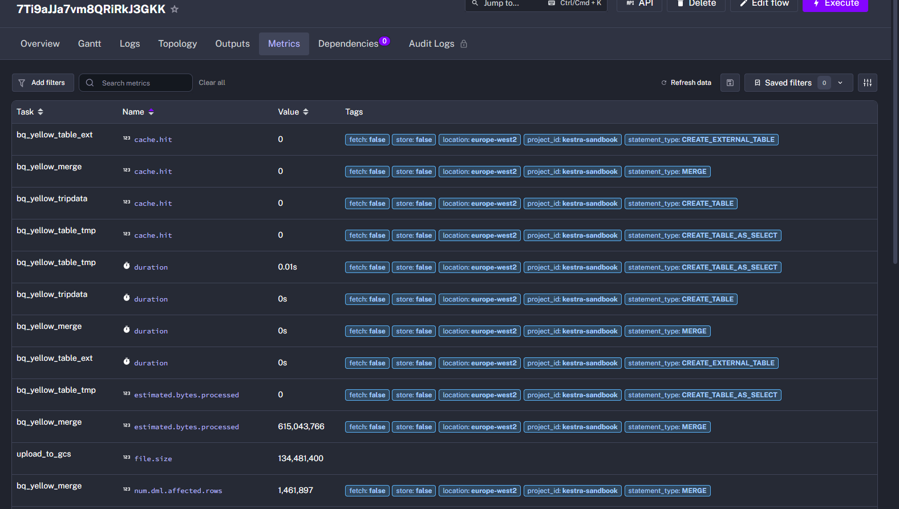
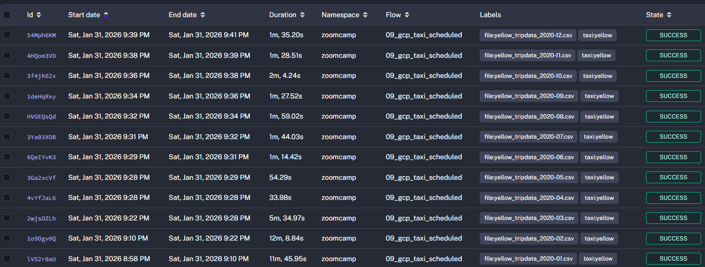
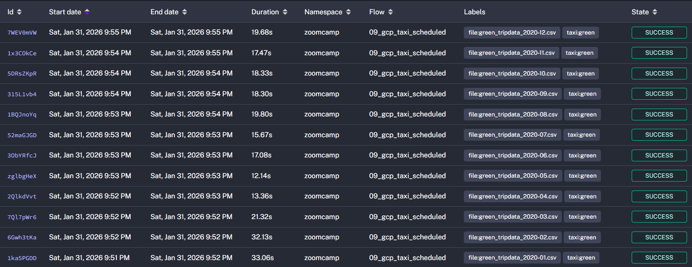

# Module 2 Homework Solution: Workflow Orchestration with Kestra

This homework focuses on workflow orchestration using Kestra and processing NYC taxi data to GCP (Cloud Storage & BigQuery).

---

## 📋 Homework Summary - Answers

| Question | Answer |
|----------|--------|
| Q1: Yellow taxi Dec 2020 file size | **128.3 MiB** |
| Q2: Variable rendering (green, 2020-04) | **green_tripdata_2020-04.csv** |
| Q3: Yellow taxi 2020 total rows | **24,648,499** |
| Q4: Green taxi 2020 total rows | **1,734,051** |
| Q5: Yellow taxi March 2021 rows | **1,925,152** |
| Q6: Timezone configuration | **Add a `timezone` property set to `America/New_York` in the `Schedule` trigger configuration** |

---

## Prerequisites

Before starting the homework, ensure you have:

✅ GCP service account configured in Kestra (see [Kestra.md](../kestra/Kestra.md#242-setup-google-cloud-platform-gcp))
✅ Flow 06 executed to store GCP configuration in KV store
✅ Flow 07 executed to create GCS bucket and BigQuery dataset
✅ Kestra running at http://localhost:8080

---

## Question 1. Understanding File Sizes

Within the execution for `Yellow` Taxi data for the year `2020` and month `12`: what is the uncompressed file size (i.e. the output file `yellow_tripdata_2020-12.csv` of the `extract` task)?

- ✅ 128.3 MiB
- 134.5 MiB
- 364.7 MiB
- 692.6 MiB

### Steps to Solve

1. **Open Kestra UI** at http://localhost:8080
   - Login with: `admin@kestra.io` / `Admin1234!`

2. **Navigate to Flow 08:**
   - Go to **Flows** → **zoomcamp** namespace → **08_gcp_taxi**

3. **Execute the flow:**
   - Click **"Execute"** button (top right)
   - Set inputs:
     - `taxi`: `yellow`
     - `year`: `2020`
     - `month`: `12`
   - Click **"Execute"**

4. **Find the file size:**
   - Wait for execution to complete (watch for green checkmarks)
   - Click on the **"Metrics"** tab at the top
   - Find the **`upload_to_gcs`** task row
   - Look for **`file.size`** metric showing bytes
   - Convert bytes to MiB: bytes ÷ (1024 × 1024)

### Solution

From the **Metrics** tab of the execution, the **upload_to_gcs** task shows:
- **file.size: 134,481,400 bytes**

Converting to MiB (binary):
- 134,481,400 ÷ (1024 × 1024) = 128.24 MiB ≈ 128.3 MiB



---

## Question 2. Understanding Variable Rendering

What is the rendered value of the variable `file` when the inputs `taxi` is set to `green`, `year` is set to `2020`, and `month` is set to `04` during execution?

- `{{inputs.taxi}}_tripdata_{{inputs.year}}-{{inputs.month}}.csv` 
- ✅ `green_tripdata_2020-04.csv`
- `green_tripdata_04_2020.csv`
- `green_tripdata_2020.csv`

### Solution

Looking at the flow definition in [08_gcp_taxi.yaml](../kestra/flows/08_gcp_taxi.yaml#L28):

```yaml
variables:
  file: "{{inputs.taxi}}_tripdata_{{inputs.year}}-{{inputs.month}}.csv"
```

The variable template `{{inputs.taxi}}_tripdata_{{inputs.year}}-{{inputs.month}}.csv` renders as follows:
- `{{inputs.taxi}}` → `green`
- `{{inputs.year}}` → `2020`
- `{{inputs.month}}` → `04`

**Result:** `green_tripdata_2020-04.csv`

**Answer: green_tripdata_2020-04.csv** ✅

---

## Question 3. Counting Yellow Taxi Rows (2020)

How many rows are there for the `Yellow` Taxi data for all CSV files in the year 2020?

- 13,537.299
- ✅ 24,648,499
- 18,324,219
- 29,430,127

### Steps to Solve

You need to run Flow 08 for all 12 months of 2020 with taxi=`yellow` and sum the row counts.

**Using Backfill (Recommended)**

1. Go to Flow **09_gcp_taxi_scheduled** 
2. Click **"Backfills"** tab (top menu)
3. Click **"Create Backfill"**
4. Configure:
   - Start date: `2020-01-01` (or `2020-01-01 00:00:00`)
   - End date: `2021-01-01` (or `2021-01-01 00:00:00`)
   - Inputs: `taxi=yellow`
5. Execute and wait for all 12 executions (one per month)
6. Go to **Executions** tab and filter by the backfill
7. For each execution, check the **Metrics** tab
8. Find the **`bq_yellow_merge`** task and look for **`num.dml.affected.rows`**
9. Sum all 12 row counts

**Monthly breakdown:**

| Month | Rows Loaded |
|-------|-------------|
| 2020-01 | 6,405,008 |
| 2020-02 | 6,299,354 |
| 2020-03 | 3,007,292 |
| 2020-04 | 237,993 |
| 2020-05 | 348,371 |
| 2020-06 | 549,760 |
| 2020-07 | 800,412 |
| 2020-08 | 1,007,284 |
| 2020-09 | 1,341,012 |
| 2020-10 | 1,681,131 |
| 2020-11 | 1,508,985 |
| 2020-12 | 1,461,897 |
| **TOTAL** | **24,648,499** |

### Solution

After running the backfill for all 12 months of 2020 with `taxi=yellow`, the total row count from all executions is:



---

## Question 4. Counting Green Taxi Rows (2020)

How many rows are there for the `Green` Taxi data for all CSV files in the year 2020?

- 5,327,301
- 936,199
- ✅ 1,734,051
- 1,342,034

### Steps to Solve

Same process as Question 3, but with `taxi=green`:

**Using Backfill:**
1. Go to Flow **09_gcp_taxi_scheduled**
2. Create another backfill:
   - Start date: `2020-01-01` (or `2020-01-01 00:00:00`)
   - End date: `2021-01-01` (or `2021-01-01 00:00:00`)
   - Inputs: `taxi=green`
3. Sum the row counts from all 12 executions (check `bq_green_merge` task in Metrics)

**Monthly breakdown:**

| Month | Rows Loaded |
|-------|-------------|
| 2020-01 | 447,770 |
| 2020-02 | 398,632 |
| 2020-03 | 223,406 |
| 2020-04 | 35,612 |
| 2020-05 | 57,360 |
| 2020-06 | 63,109 |
| 2020-07 | 72,257 |
| 2020-08 | 81,063 |
| 2020-09 | 87,987 |
| 2020-10 | 95,120 |
| 2020-11 | 88,605 |
| 2020-12 | 83,130 |
| **TOTAL** | **1,734,051** |

### Solution

After running the backfill for all 12 months of 2020 with `taxi=green`, the total row count from all executions is:

**Answer: 1,734,051** ✅



---

## Question 5. Counting Yellow Taxi Rows (March 2021)

How many rows are there for the `Yellow` Taxi data for the March 2021 CSV file?

- 1,428,092
- 706,911
- ✅ 1,925,152
- 2,561,031

### Steps to Solve

1. **Execute Flow 08:**
   - Inputs: `taxi=yellow`, `year=2021`, `month=03`
   - Note: You can type `2021` in the year field (allowCustomValue is enabled)

2. **Find the row count:**
   - After execution completes, go to the **Metrics** tab
   - Find the **`bq_yellow_merge`** task row
   - Look for **`num.dml.affected.rows`** metric

### Solution

From the **Metrics** tab, the **bq_yellow_merge** task shows:
- **num.dml.affected.rows: 1,925,152**

---

## Question 6. Timezone Configuration

How would you configure the timezone to New York in a Schedule trigger?

- Add a `timezone` property set to `EST` in the `Schedule` trigger configuration  
- ✅ Add a `timezone` property set to `America/New_York` in the `Schedule` trigger configuration
- Add a `timezone` property set to `UTC-5` in the `Schedule` trigger configuration
- Add a `location` property set to `New_York` in the `Schedule` trigger configuration  

### Solution

Looking at the Schedule trigger in Kestra, the correct way to configure timezone is using the IANA timezone database format.

**Example from [09_gcp_taxi_scheduled.yaml](../kestra/flows/09_gcp_taxi_scheduled.yaml):**

```yaml
triggers:
  - id: yellow_schedule
    type: io.kestra.plugin.core.trigger.Schedule
    cron: "0 10 1 * *"
    timezone: America/New_York  # Add this property
    inputs:
      taxi: yellow
```

**Explanation:**
- ✅ `America/New_York` - Correct IANA timezone format
- ❌ `EST` - Doesn't account for daylight saving time
- ❌ `UTC-5` - Not a valid Kestra timezone format
- ❌ `location` - Wrong property name (should be `timezone`)

**Reference:** [Kestra Schedule Trigger Documentation](https://kestra.io/plugins/core/triggers/io.kestra.plugin.core.trigger.schedule)

---

## Terraform Question (Bonus)

The homework also mentions extending flows for 2021 data. Our flows already support this:

**Flow 08** allows custom year input (type `2021` in the year field)

**Flow 09** can backfill any date range:
- For 2021 green taxi: backfill from `2021-01-01` to `2021-07-31`
- For 2021 yellow taxi: backfill from `2021-01-01` to `2021-07-31`

---

## Cleanup After Homework

To avoid GCP charges after completing the homework, see [Kestra.md - Cleanup Section](../kestra/Kestra.md#243-cleanup-gcp-resources) for instructions on deleting:
- GCS bucket and files
- BigQuery dataset and tables