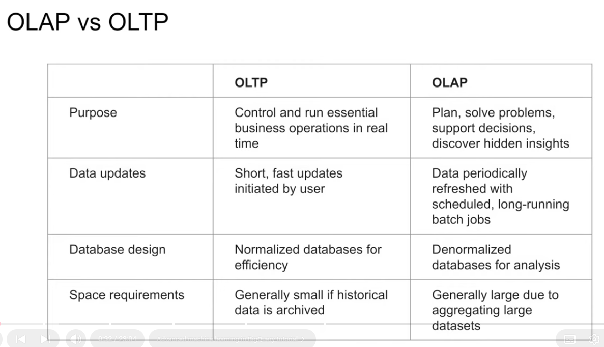
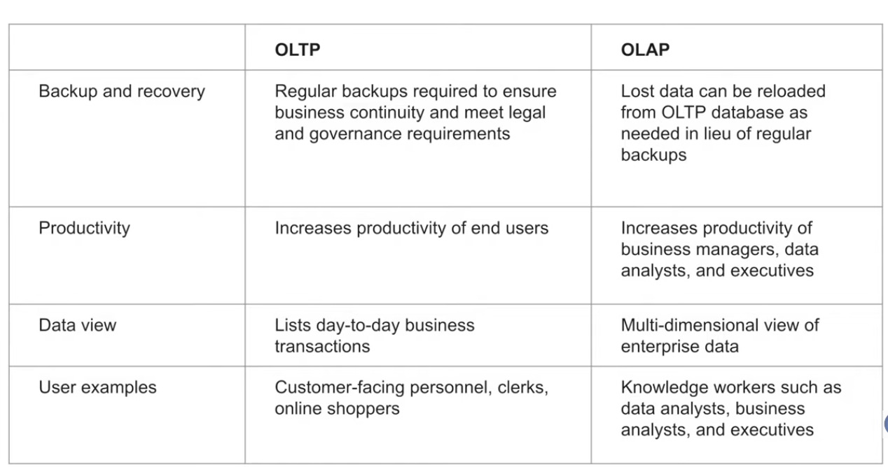
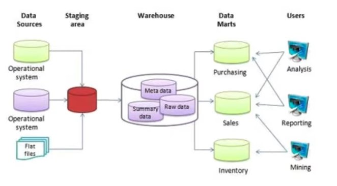
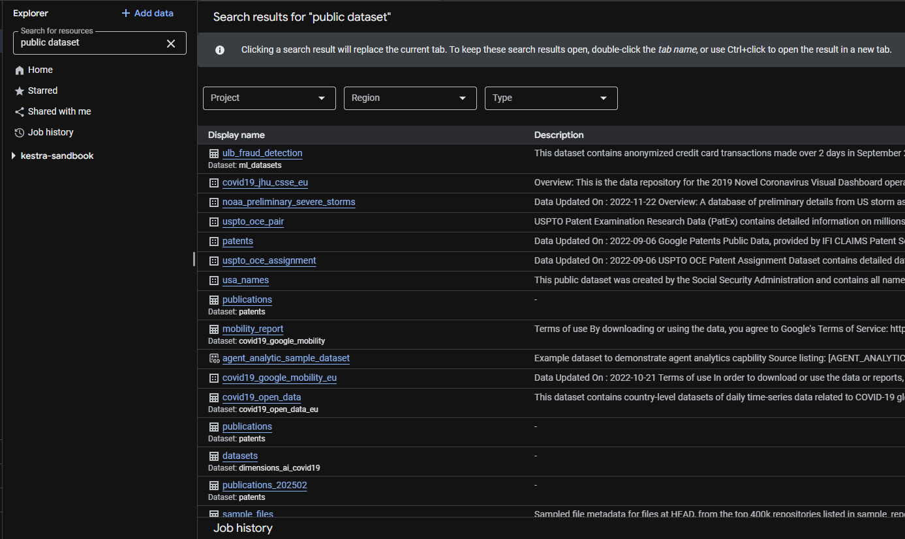
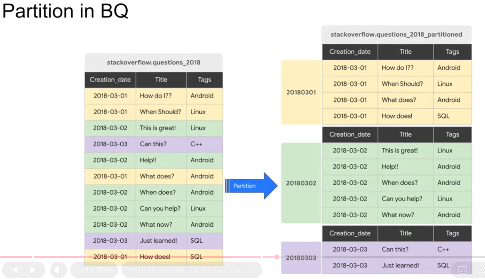
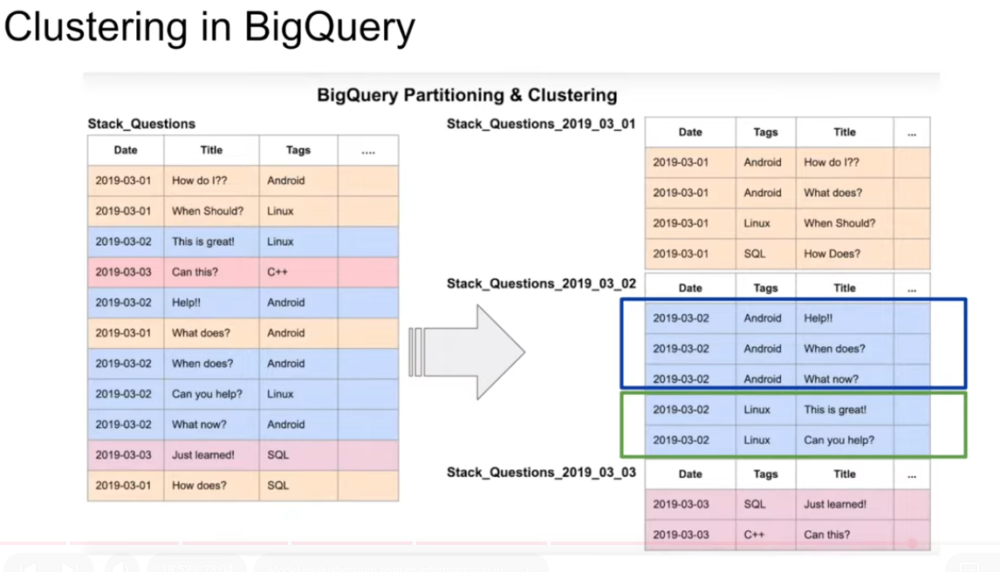
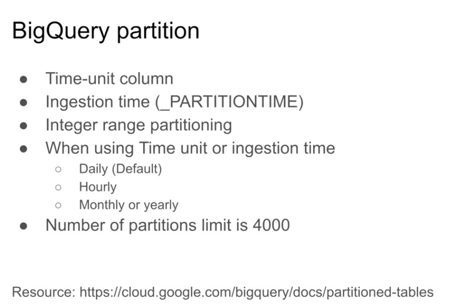
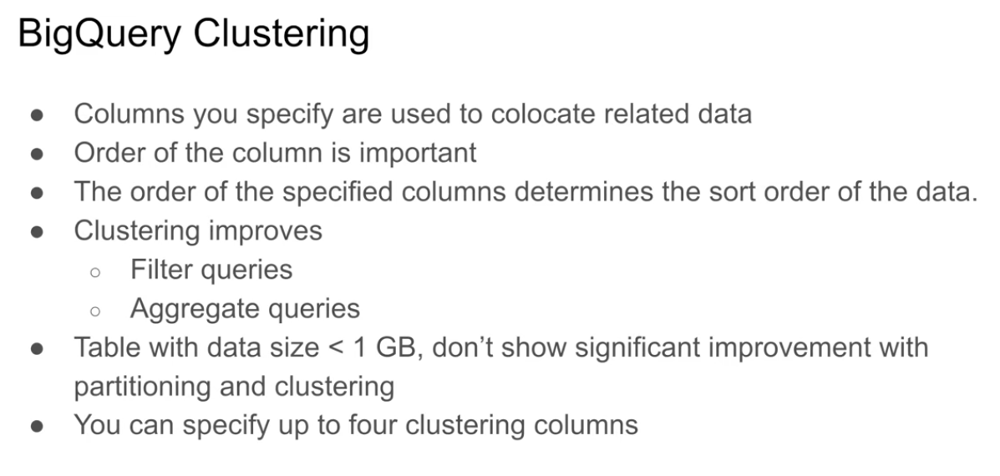
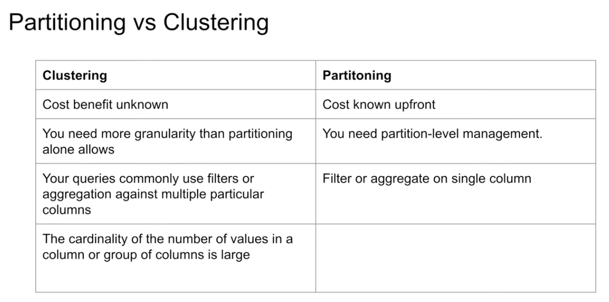
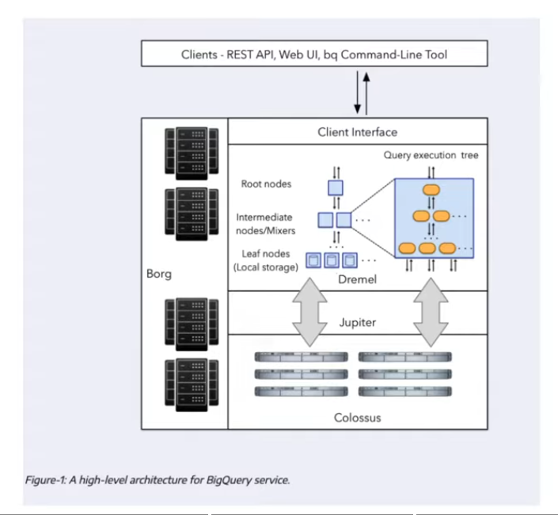

# OLAP vs OLTP

- OLAP (Online Analytical Processing) and OLTP (Online Transaction Processing) are two different types of database systems that serve different purposes.





# What is a data warehouse?

- It is an OLAP solution, because it is designed for analytical processing and reporting, rather than transactional processing. It is a centralized repository of integrated data from one or more disparate sources, used for reporting and data analysis.

- Normally, a data warehouse consists of:
    - raw data storage
    - metadata layer
    - summary data storage layer



# What is BigQuery?

- Serverless data warehouse solution provided by Google Cloud Platform (GCP) that allows users to store and analyze large datasets using SQL-like queries. It is designed for high performance and scalability, making it suitable for handling big data workloads.

- Software as well as infrastructure includes:
    - Scalability and high-availability

- Built-in features like:
    - machine learning
    - geospatial analysis
    - business intelligence

- BigQuery maximizes flexibility by separating the compute engine that analyzes your data from your storage. This means that you can scale your compute resources up or down independently of your storage needs, allowing you to optimize performance and cost.

## BigQuery Datasets
- BigQuery has public datasets that are available for anyone to query and analyze. These datasets cover a wide range of topics, including:
    - weather data (NOAA)
    - financial data (e.g., stock market data)
    - social media data (e.g., Twitter)
    - scientific data (e.g., genomics)
    - mobility data (e.g., taxi trips in New York City)

- We can check them in the BigQuery console under "Public Datasets" or by visiting the Google Cloud Public Datasets page at https://cloud.google.com/public-datasets. These datasets are often used for educational purposes, research, and to demonstrate the capabilities of BigQuery. They can be accessed and queried using SQL, just like any other dataset in BigQuery.



Because in module 02 we deleted the taxi data from our project, we are going to create a new dataset in Google BigQuery and load the taxi data from the public datasets to our project dataset.

## BigQuery Pricing

- **On-demand pricing**: You pay for the amount of data you query and the amount of data you store. This is a flexible option that allows you to pay only for what you use. 1TB of data queried costs $5, and 1GB of data stored costs $0.02 per month.

- **Flat-rate pricing**: You pay a fixed monthly fee for a certain amount of data storage and query processing. Based on number of slots (virtual CPUs) you need. This is a good option for organizations with predictable workloads and high query volumes. For example, 100 slots cost $2,000 per month.

# Creating External Tables in BigQuery

External tables allow you to query data stored in Google Cloud Storage (GCS) without loading it into BigQuery. The data remains in GCS, and BigQuery queries it directly.

## Starting Point
- We have a GCP project: `kestra-sandbook`
- No BigQuery datasets created yet
- No GCS buckets with taxi data

## Steps to Create External Table

**Note:** The column names in the public dataset differ from the names shown in some videos. For example, `VENDORID` in the video is `vendor_id` in the public dataset. Use the column names from the public dataset in your queries and table creation.

### Step 1: Set Active GCP Project
```bash
gcloud config set project kestra-sandbook
```

### Step 2: Create BigQuery Dataset
```bash
bq mk --dataset --location=US kestra-sandbook:nytaxi
```

**Note**: Use `US` location since the NYC taxi data is in US region for better performance and to avoid cross-region data transfer costs.

### Step 3: Create GCS Bucket for Data Storage
```bash
gsutil mb -p kestra-sandbook -l US gs://kestra-sandbook-taxi-data
```

### Step 4: Export Data from Public BigQuery Dataset to GCS

Export 2019 data:
```bash
bq extract \
  --destination_format=CSV \
  --compression=NONE \
  --field_delimiter=',' \
  --print_header=true \
  'bigquery-public-data:new_york_taxi_trips.tlc_yellow_trips_2019' \
  'gs://kestra-sandbook-taxi-data/yellow_tripdata_2019-*.csv'
```

Export 2020 data:
```bash
bq extract \
  --destination_format=CSV \
  --compression=NONE \
  --field_delimiter=',' \
  --print_header=true \
  'bigquery-public-data:new_york_taxi_trips.tlc_yellow_trips_2020' \
  'gs://kestra-sandbook-taxi-data/yellow_tripdata_2020-*.csv'
```

**Note**: BigQuery exports large datasets into multiple files automatically (sharding). This is normal and efficient for parallel processing.

### Step 5: Verify Files in GCS Bucket
```bash
gsutil ls gs://kestra-sandbook-taxi-data/
```

You should see multiple CSV files:
- `yellow_tripdata_2019-000000000000.csv` through `yellow_tripdata_2019-000000000135.csv` (136 files)
- `yellow_tripdata_2020-000000000000.csv` through `yellow_tripdata_2020-000000000033.csv` (34 files)

### Step 6: Create External Table Referencing GCS Files
```bash
bq query --use_legacy_sql=false \
"CREATE OR REPLACE EXTERNAL TABLE \`kestra-sandbook.nytaxi.external_yellow_tripdata\`
OPTIONS (
  format = 'CSV',
  uris = [
    'gs://kestra-sandbook-taxi-data/yellow_tripdata_2019-*.csv',
    'gs://kestra-sandbook-taxi-data/yellow_tripdata_2020-*.csv'
  ]
);"
```

Or directly in BigQuery UI SQL editor:
```sql
CREATE OR REPLACE EXTERNAL TABLE `kestra-sandbook.nytaxi.external_yellow_tripdata`
OPTIONS (
  format = 'CSV',
  uris = [
    'gs://kestra-sandbook-taxi-data/yellow_tripdata_2019-*.csv',
    'gs://kestra-sandbook-taxi-data/yellow_tripdata_2020-*.csv'
  ]
);
```

### Step 7: Verify External Table
List tables in dataset:
```bash
bq ls kestra-sandbook:nytaxi
```

Query the external table:
```bash
bq query --use_legacy_sql=false \
'SELECT COUNT(*) as total_rows FROM `kestra-sandbook.nytaxi.external_yellow_tripdata`;'
```

Expected result: **109,247,514 rows** (combined 2019 and 2020 data)

## External Table vs Regular Table

### External Table (What we created)
- **Data location**: Google Cloud Storage (GCS)
- **Storage cost**: Charged at GCS storage rates (~$0.02/GB/month)
- **Query performance**: Slightly slower than native tables
- **Use case**: When data is already in GCS or frequently updated externally
- **Benefits**: No data duplication, query directly from source

### Regular Table (Alternative approach)
- **Data location**: BigQuery storage
- **Storage cost**: Charged at BigQuery storage rates (~$0.02/GB/month)
- **Query performance**: Faster, optimized for BigQuery
- **Use case**: Frequent queries, need fast performance
- **Benefits**: Better performance, can use features like partitioning and clustering

To create a regular table instead:
```sql
CREATE OR REPLACE TABLE `kestra-sandbook.nytaxi.yellow_tripdata_2019` AS
SELECT * FROM `bigquery-public-data.new_york_taxi_trips.tlc_yellow_trips_2019`
LIMIT 100000;  -- Adjust limit as needed
```

## Key Takeaways
- External tables keep data in GCS, BigQuery queries it remotely
- Wildcards (`*`) in URIs allow querying multiple files as one table
- BigQuery automatically handles sharded files (multiple CSV files)
- Use `US` location for US-based data to avoid cross-region charges
- External tables don't support all BigQuery features (e.g., DML operations)

## Partitioning in BigQuery



Partitioning is a technique to divide a large table into smaller, more manageable pieces based on a column (usually a date). This improves query performance and reduces costs by allowing BigQuery to scan only the relevant data.

### Why Use Partitioning?

- **Improved Query Performance**: Query only the partitions you need instead of scanning the entire table
- **Reduced Costs**: You only pay for the data scanned, not the entire table
- **Better Data Organization**: Similar data is grouped together
- **Easier Maintenance**: Can delete or update specific date ranges without affecting other data

### Creating Tables from External Table

#### Option 1: Non-Partitioned Table (No Optimization)

```bash
bq query --use_legacy_sql=false \
'CREATE OR REPLACE TABLE kestra-sandbook.nytaxi.yellow_tripdata_non_partitioned AS
SELECT * FROM kestra-sandbook.nytaxi.external_yellow_tripdata;'
```

Or in BigQuery UI:
```sql
CREATE OR REPLACE TABLE kestra-sandbook.nytaxi.yellow_tripdata_non_partitioned AS
SELECT * FROM kestra-sandbook.nytaxi.external_yellow_tripdata;
```

**Characteristics:**
- All 109M rows stored in one table
- Every query scans the entire table
- Higher query costs since no filtering is possible at storage level
- Simple structure but inefficient for large datasets
- Best for: Small datasets or when you always need all data

#### Option 2: Partitioned Table (Optimized)

```bash
bq query --use_legacy_sql=false \
'CREATE OR REPLACE TABLE kestra-sandbook.nytaxi.yellow_tripdata_partitioned
PARTITION BY DATE(pickup_datetime) AS
SELECT * FROM kestra-sandbook.nytaxi.external_yellow_tripdata;'
```

Or in BigQuery UI:
```sql
CREATE OR REPLACE TABLE kestra-sandbook.nytaxi.yellow_tripdata_partitioned
PARTITION BY DATE(pickup_datetime) AS
SELECT * FROM kestra-sandbook.nytaxi.external_yellow_tripdata;
```

**Characteristics:**
- Table partitioned by date from `pickup_datetime` column
- Each day's data stored in a separate partition
- Query only specific dates to reduce scanning
- Significantly lower query costs
- Best for: Large datasets with time-series data (very common for taxi data)

### Cost & Performance Comparison

Assume querying only **January 2020** data:

| Metric | Non-Partitioned | Partitioned |
|--------|-----------------|------------|
| Data Scanned | ~110 GB (entire table + 2020 data) | ~5 GB (only Jan 2020) |
| Query Cost | ~$0.55 (110 GB ÷ 200 = $0.55 per TB) | ~$0.025 (5 GB ÷ 200 = $0.025 per TB) |
| Cost Savings | — | **95% cheaper** |
| Query Speed | Slower | Much faster |

### Example Queries

Query a specific date on **non-partitioned table** (scans entire table):
```sql
SELECT COUNT(*) FROM kestra-sandbook.nytaxi.yellow_tripdata_non_partitioned
WHERE DATE(pickup_datetime) = '2020-01-15';
```

Query a specific date on **partitioned table** (scans only that partition):
```sql
SELECT COUNT(*) FROM kestra-sandbook.nytaxi.yellow_tripdata_partitioned
WHERE DATE(pickup_datetime) = '2020-01-15';
```

Both queries return the same result, but the partitioned query is much cheaper!

### Real-World Example: June 2019 Taxi Data

Here's a practical example querying taxi data for a specific month:

**Non-Partitioned Table Query** (Less Efficient):
```sql
-- Scanning 1.6GB of data
SELECT DISTINCT(vendor_id)
FROM kestra-sandbook.nytaxi.yellow_tripdata_non_partitioned
WHERE DATE(pickup_datetime) BETWEEN '2019-06-01' AND '2019-06-30';
```

**Partitioned Table Query** (Optimized):
```sql
-- Scanning ~106 MB of data
SELECT DISTINCT(vendor_id)
FROM kestra-sandbook.nytaxi.yellow_tripdata_partitioned
WHERE DATE(pickup_datetime) BETWEEN '2019-06-01' AND '2019-06-30';
```

**Results:**
- **Non-Partitioned**: Scans **1.6 GB** → Cost: ~$0.008
- **Partitioned**: Scans **106 MB** → Cost: ~$0.0005
- **Savings**: **93% reduction** in data scanned and cost!

Both queries return the exact same result (`DISTINCT vendor_id` for June 2019), but:
- The non-partitioned query must scan the entire 110 GB table
- The partitioned query only reads the 30 partitions for June 2019 (~1.6 GB combined)
- BigQuery then prunes down to just that ~106 MB for processing

**This is why partitioning is crucial for large datasets!**

### When to Use Each Approach

| Scenario | Use Non-Partitioned | Use Partitioned |
|----------|-------------------|-----------------|
| Small dataset (<10 GB) | ✅ | — |
| Large dataset (>100 GB) | ❌ | ✅ |
| Always query all data | ✅ | — |
| Query specific time ranges | ❌ | ✅ |
| Real-time data ingestion | — | ✅ |
| One-time analysis | ✅ | — |

### Best Practices for Taxi Data

For the NYC taxi dataset, **always use partitioning** because:
- Dataset is very large (100+ GB)
- Data has clear time dimension (`pickup_datetime`)
- Most queries are for specific date ranges
- Massive cost savings possible

Recommended approach:
```sql
CREATE OR REPLACE TABLE kestra-sandbook.nytaxi.yellow_tripdata_partitioned
PARTITION BY DATE(pickup_datetime) AS
SELECT * FROM kestra-sandbook.nytaxi.external_yellow_tripdata;

-- Query example: Get all trips from a specific date
SELECT * FROM kestra-sandbook.nytaxi.yellow_tripdata_partitioned
WHERE DATE(pickup_datetime) = '2020-01-15'
LIMIT 100;
```

### Monitoring Partition Distribution

It's important to check if your data is evenly distributed across partitions. Bias in partitions (some partitions with many more rows than others) can lead to:
- Uneven query performance
- Some partitions being heavily scanned while others are rarely used
- Potential data skew issues

#### Query Partition Statistics

Use BigQuery's `INFORMATION_SCHEMA` to see how many rows are in each partition:

```bash
bq query --use_legacy_sql=false \
'SELECT table_name, partition_id, total_rows
FROM `nytaxi.INFORMATION_SCHEMA.PARTITIONS`
WHERE table_name = "yellow_tripdata_partitioned"
ORDER BY total_rows DESC;'
```

Or in BigQuery UI:
```sql
SELECT table_name, partition_id, total_rows
FROM `nytaxi.INFORMATION_SCHEMA.PARTITIONS`
WHERE table_name = 'yellow_tripdata_partitioned'
ORDER BY total_rows DESC;
```

#### Understanding the Results

This query returns:
- **table_name**: Name of the partitioned table
- **partition_id**: The partition identifier (date in format YYYYMMDD)
- **total_rows**: Number of rows in that partition

**Example Output:**
```
table_name                    partition_id  total_rows
yellow_tripdata_partitioned   20190601      52,345
yellow_tripdata_partitioned   20190602      48,923
yellow_tripdata_partitioned   20190603      51,234
yellow_tripdata_partitioned   20190604      49,876
...
```

#### Detecting Partition Bias

Look for:
1. **Large Variance**: Some partitions with 100K rows, others with 1M rows
2. **Empty Partitions**: Partitions with 0 rows (missing data)
3. **Skewed Distribution**: Most data concentrated in a few partitions

**Example of Partition Bias:**
```
partition_id  total_rows
20190101      2,500,000    ← Heavy traffic day (holiday shopping)
20190102      1,845,000
20190103      2,100,000
20190104      45,000       ← Unusually low (data quality issue?)
...
```

This reveals that certain dates have much higher taxi traffic (potentially weekends or holidays) or data collection anomalies.

#### Real-World Example: Your Taxi Data

Here's the actual output from your `kestra-sandbook` project:

```
Row	table_name                    partition_id  total_rows
1	  yellow_tripdata_partitioned   20190201      299,260
2	  yellow_tripdata_partitioned   20190405      293,969
3	  yellow_tripdata_partitioned   20190125      292,499
4	  yellow_tripdata_partitioned   20190307      292,405
5	  yellow_tripdata_partitioned   20190111      291,714
6	  yellow_tripdata_partitioned   20190208      289,576
7	  yellow_tripdata_partitioned   20191219      286,932
8	  yellow_tripdata_partitioned   20190306      286,297
```

**Analysis:**

- **Distribution**: Very balanced! Rows per partition range from 286K to 299K
- **Variance**: Only ~13K rows difference (4.5% variance) - excellent distribution
- **No Bias**: No partitions with unusually high or low values
- **Data Quality**: All partitions have similar row counts, suggesting consistent data collection

This is a **healthy partition distribution** - no data quality concerns or significant skew that would cause performance issues.

**Key Observation**: The dates appear random (Feb 1, Apr 5, Jan 25, etc.), which indicates the data is evenly spread across 2019. Your partitioned table is optimally configured!

#### Benefits of Monitoring Partitions

- **Data Quality**: Identify missing or corrupted data
- **Query Optimization**: Know which partitions contain most data
- **Cost Planning**: Estimate query costs based on partition distribution
- **Performance Tuning**: Understand data skew that might affect query performance

## Clustering in BigQuery



Clustering is an optimization technique that orders data based on the values of one or more columns. When you cluster a table, BigQuery physically organizes the data so that rows with similar values in the clustered columns are stored together. This further reduces the amount of data BigQuery needs to scan when you query those columns.

### Clustering vs Partitioning

While both improve performance, they work differently:

| Feature | Partitioning | Clustering |
|---------|--------------|-----------|
| **Mechanism** | Divides table into separate partitions by date/time | Physically orders rows by column values |
| **Use Case** | Filter by date/time ranges | Filter by specific column values |
| **Columns** | Usually 1 (date column) | 1-4 columns recommended |
| **Performance** | Excellent for time-based queries | Excellent for filtering on specific values |
| **Cost** | Reduces scan volume | Reduces scan volume |
| **Combined Power** | Can use together for maximum benefit | Works best with partitioning |

### Why Combine Partitioning and Clustering?

- **Partitioning** narrows down which date ranges to scan
- **Clustering** then orders data within those partitions for faster filtering

Example: Query for `vendor_id = 1` between specific dates
1. Partitioning filters to only June 2019 - December 2020 partitions
2. Clustering finds all `vendor_id = 1` rows within those partitions more efficiently

### Creating a Partitioned & Clustered Table

```bash
bq query --use_legacy_sql=false \
'CREATE OR REPLACE TABLE kestra-sandbook.nytaxi.yellow_tripdata_partitioned_clustered
  PARTITION BY DATE(pickup_datetime)
  CLUSTER BY vendor_id
AS
SELECT * FROM kestra-sandbook.nytaxi.external_yellow_tripdata;'
```

Or in BigQuery UI:
```sql
CREATE OR REPLACE TABLE kestra-sandbook.nytaxi.yellow_tripdata_partitioned_clustered
  PARTITION BY DATE(pickup_datetime)
  CLUSTER BY vendor_id
AS
SELECT * FROM kestra-sandbook.nytaxi.external_yellow_tripdata;
```

**Key Points:**
- `PARTITION BY DATE(pickup_datetime)`: Divides data by date
- `CLUSTER BY vendor_id`: Orders data within partitions by vendor_id
- This is powerful when you frequently query by **both** date range AND vendor_id

### Real-World Performance Comparison

Scenario: Querying trips from a specific vendor between specific dates (a common analysis)

**Query 1: Partitioned Table Only** (Scans 1.1 GB):
```sql
SELECT COUNT(*) AS trips
FROM kestra-sandbook.nytaxi.yellow_tripdata_partitioned
WHERE
  DATE(pickup_datetime) BETWEEN '2019-06-01' AND '2020-12-31'
  AND vendor_id = 1;
```

**Query 2: Partitioned & Clustered Table** (Scans 864.5 MB):
```sql
SELECT COUNT(*) AS trips
FROM kestra-sandbook.nytaxi.yellow_tripdata_partitioned_clustered
WHERE
  DATE(pickup_datetime) BETWEEN '2019-06-01' AND '2020-12-31'
  AND vendor_id = 1;
```

**Performance Results:**
- **Partitioned Only**: 1.1 GB scanned → Cost: ~$0.0055
- **Partitioned + Clustered**: 864.5 MB scanned → Cost: ~$0.00432
- **Additional Savings**: **21.4% reduction** compared to partitioned only!
- **Total Savings vs Non-Partitioned**: ~98% (from 110 GB to 864.5 MB)

### Use Case: Vendor Analysis

In the taxi dataset, vendors 1 and 2 operate in different regions with different characteristics. If your analysis frequently:
- Filters by specific vendor_id
- Combines vendor filter with date ranges

Then clustering by `vendor_id` makes sense:

```sql
-- This query benefits greatly from clustering by vendor_id
SELECT 
  DATE(pickup_datetime) as trip_date,
  COUNT(*) as trip_count,
  AVG(trip_distance) as avg_distance
FROM kestra-sandbook.nytaxi.yellow_tripdata_partitioned_clustered
WHERE
  DATE(pickup_datetime) BETWEEN '2019-06-01' AND '2020-12-31'
  AND vendor_id = 1
GROUP BY trip_date
ORDER BY trip_date;
```

### When to Use Clustering

**Use Clustering when you:**
- Frequently filter on specific non-date columns
- Query specific vendors, routes, or payment types
- Need to optimize recurring queries with complex WHERE clauses
- Work with large datasets where every GB scanned adds cost

**Don't Use Clustering when you:**
- Only filter by date/time (partitioning is enough)
- Have random queries with no pattern
- Table is small (<100 GB)

### Best Clustering Columns for Taxi Data

Good candidates for clustering:
1. **vendor_id**: Filter by specific taxi vendor (1 or 2)
2. **payment_type**: Filter by payment method
3. **pickup_location_id**: Filter by pickup area
4. **dropoff_location_id**: Filter by dropoff area

Example with multiple clustering columns:
```sql
CREATE OR REPLACE TABLE kestra-sandbook.nytaxi.yellow_tripdata_optimized
  PARTITION BY DATE(pickup_datetime)
  CLUSTER BY vendor_id, payment_type
AS
SELECT * FROM kestra-sandbook.nytaxi.external_yellow_tripdata;
```

### Important Notes on Clustering

- **Maximum Columns**: You can cluster by up to 4 columns
- **Column Order Matters**: Put most frequently filtered columns first
- **Re-clustering**: BigQuery automatically re-orders data as new data arrives
- **Cost**: Clustering itself doesn't add storage cost, only improves query performance
- **Recommendation**: Always combine with partitioning for large time-series data

### Example: Clustered Table Data Structure

When you query the clustered table, notice how **all `vendor_id = 1` rows are grouped together**. This is the key benefit of clustering:

```sql
SELECT * FROM kestra-sandbook.nytaxi.yellow_tripdata_partitioned_clustered
WHERE vendor_id = 1 AND DATE(pickup_datetime) = '2019-05-30'
LIMIT 14;
```

**Example Output:**
```
Row  vendor_id  pickup_datetime              pickup_location_id  payment_type  trip_distance
1    1          2019-05-30 00:42:12 UTC      75                  3             0.0
2    1          2019-05-30 05:22:30 UTC      145                 2             0.0
3    1          2019-05-30 08:40:48 UTC      137                 3             0.0
4    1          2019-05-30 00:47:06 UTC      75                  3             0.0
5    1          2019-05-30 00:44:47 UTC      75                  3             0.0
6    1          2019-05-30 00:50:41 UTC      263                 3             0.0
7    1          2019-05-30 00:43:26 UTC      75                  3             0.0
8    1          2019-05-30 17:43:43 UTC      71                  3             0.0
9    1          2019-05-30 01:06:33 UTC      145                 1             17.2
10   1          2019-05-30 14:09:33 UTC      239                 2             0.0
11   1          2019-05-30 00:42:56 UTC      75                  3             0.0
12   1          2019-05-30 15:41:21 UTC      114                 3             0.5
13   1          2019-05-30 07:08:14 UTC      88                  3             0.0
14   1          2019-05-30 14:40:29 UTC      75                  2             0.0
```

**What's Happening Here:**

- **All 14 rows have `vendor_id = 1`** - Clustering by vendor_id groups all vendor 1 trips together
- **Without clustering**: BigQuery would scan the entire table looking for vendor_id = 1 rows scattered throughout
- **With clustering**: BigQuery knows all vendor_id = 1 data is in one contiguous block, so it only scans that block
- **Result**: 21.4% less data scanned (864.5 MB vs 1.1 GB) for the same query

This physical co-location of similar data is why clustering delivers such dramatic performance improvements for filtered queries!


## Review of Partitioning and Clustering Best Practices

BigQuery's partitioning and clustering features are powerful tools for optimizing query performance and reducing costs. Here are some best practices to keep in mind when working with partitioned and clustered tables:




- partitioning is most effective when you have a large dataset with a clear time-based column (e.g., `pickup_datetime` in taxi data)
- choose a partitioning column that is frequently used in query filters to maximize performance benefits
- avoid partitioning on columns with low cardinality (few unique values) as it may not provide significant performance benefits
- monitor partition distribution regularly to ensure optimal performance and identify any data skew issues




- clustering columns must be top-level columns (not nested)
- clustering columns must be of type STRING, INTEGER, or TIMESTAMP
- clustering columns should have high cardinality (many unique values) for best performance
- avoid clustering on columns with low cardinality (few unique values) as it may not provide significant performance benefits
- monitor partition and cluster distribution regularly to ensure optimal performance



Automatic reclustering is a feature in BigQuery that reorganizes clustered tables as new data is inserted or existing data is updated. This keeps clustering effective over time without manual intervention.

## BigQuery - Best Practices

### Cost reduction
- avoid SELECT * queries
- price your queries before running them
- use clustering or partitioning to reduce the amount of data scanned
- use streaming inserts with caution, as they can be more expensive than batch loading data
- materialize query results in stages to avoid re-scanning large datasets multiple times

### Query performance
- filter on partitioned columns to reduce the amount of data scanned
- denormalize your data to reduce the need for complex joins
- use nested or repeated columns to optimize storage and query performance
- use external data sources appropriately, as they can be slower than native BigQuery tables
  - do not use external tables when you need high query performance
- reduce data before using a JOIN operation to minimize the amount of data being processed
- do not treat WITH clauses as prepared statements; materialize results into a temporary table if reused
- avoid oversharding tables; use a reasonable number of partitions or clusters based on data size and query patterns

## BigQuery Internals (High Level)



This diagram shows the major systems that work together when you run a query:

- **Clients**: REST API, Web UI, and `bq` CLI send SQL queries to BigQuery.
- **Client Interface**: Receives requests, validates SQL, and builds the execution plan.
- **Dremel**: The distributed query engine. It turns your SQL into a **query execution tree** with:
  - **Root nodes**: Coordinate the query and merge results.
  - **Intermediate nodes (mixers)**: Shuffle and aggregate partial results.
  - **Leaf nodes**: Scan the data stored locally and return partial results.
- **Borg**: Google’s cluster manager that schedules and runs the compute nodes.
- **Jupiter**: High-bandwidth network fabric that moves data between compute and storage.
- **Colossus**: The distributed storage layer where BigQuery data lives.

**Key idea**: BigQuery separates **compute (Dremel)** from **storage (Colossus)**, so it can scale queries up or down without moving or duplicating your data.

Bigquery uses column oriented storage and execution, which means it only reads the columns needed for your query, further optimizing performance.