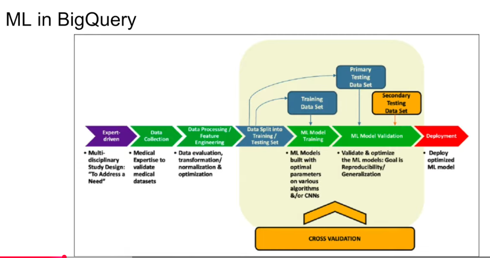
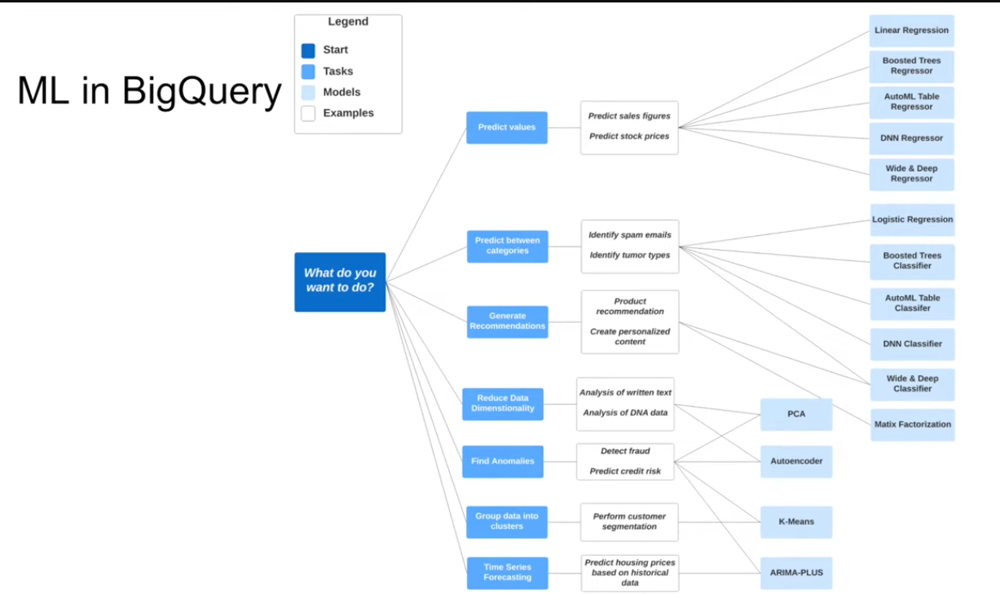

# ML in BigQuery

- **Target audience**: Data analysts, managers
- **No need for Python or Java knowledge**
- **No need to export data into a different system**

## ML in BigQuery: Overview

- Free
    - 10 GB per month of data storage
    - 1 TB of data processed per month for training and prediction
    - ML create model step: 10 GB of data processed per month


## ML steps



This diagram shows the typical end-to-end ML workflow:

1. **Expert-driven problem definition**: Define the business problem and success metrics.
2. **Data collection**: Gather relevant data from databases, logs, or external sources.
3. **Data processing / feature engineering**: Clean, normalize, and transform raw data into model-ready features.
4. **Data split**: Divide the dataset into training and testing sets (sometimes also a validation set).
5. **Model training**: Train the ML model on the training set.
6. **Model validation**: Evaluate performance on validation/test data and tune parameters.
7. **Cross-validation**: Repeat training/validation on different splits to reduce bias and improve generalization.
8. **Deployment**: Push the optimized model to production for predictions.

Key idea: iterate between steps 3-7 until performance is acceptable, then deploy.



This diagram helps you choose the right BigQuery ML model based on the question you want to answer:

1. **Predict values (Regression)**
    - Example: predict sales or stock prices
    - Models: Linear Regression, Boosted Trees Regressor, AutoML Tables Regressor, DNN Regressor, Wide & Deep Regressor

2. **Predict between categories (Classification)**
    - Example: spam detection, tumor type classification
    - Models: Logistic Regression, Boosted Trees Classifier, AutoML Tables Classifier, DNN Classifier, Wide & Deep Classifier

3. **Generate recommendations (Recommendation systems)**
    - Example: product recommendations or personalized content
    - Models: Matrix Factorization (collaborative filtering)

4. **Reduce data dimensionality**
    - Example: summarize large feature sets or detect patterns in text/DNA
    - Models: PCA (Principal Component Analysis)

5. **Find anomalies (Anomaly detection)**
    - Example: fraud detection or credit risk outliers
    - Models: Autoencoder

6. **Group data into clusters (Clustering)**
    - Example: customer segmentation
    - Models: K-Means

7. **Time series forecasting**
    - Example: forecasting housing prices or demand trends
    - Models: ARIMA/ARIMA-PLUS

**Key idea**: Start from the business question, then choose the task type (regression, classification, clustering, etc.), and finally pick the model that best fits your data size, complexity, and desired accuracy.

## Building a Model: Predicting Taxi Tip Amount

We'll build a linear regression model to predict tip amounts using the NYC taxi dataset. Follow these steps:

### Step 1: Select Features
First, examine the columns we want to use for predictions:

```sql
SELECT passenger_count, trip_distance, pickup_location_id, dropoff_location_id, 
       payment_type, fare_amount, tolls_amount, tip_amount
FROM `kestra-sandbook.nytaxi.yellow_tripdata_partitioned` 
WHERE fare_amount != 0;
```

### Step 2: Prepare Data for ML
Create a table with proper data types for BigQuery ML:

```sql
CREATE OR REPLACE TABLE `kestra-sandbook.nytaxi.yellow_tripdata_ml` AS
SELECT 
  passenger_count, 
  trip_distance, 
  CAST(pickup_location_id AS STRING) as pickup_location_id, 
  CAST(dropoff_location_id AS STRING) as dropoff_location_id,
  CAST(payment_type AS STRING) as payment_type, 
  fare_amount, 
  tolls_amount, 
  tip_amount
FROM `kestra-sandbook.nytaxi.yellow_tripdata_partitioned` 
WHERE fare_amount != 0 AND tip_amount IS NOT NULL;
```

### Step 3: Train the Model
Create a linear regression model with default settings:

```sql
CREATE OR REPLACE MODEL `kestra-sandbook.nytaxi.tip_model`
OPTIONS(
  model_type='linear_reg',
  input_label_cols=['tip_amount'],
  DATA_SPLIT_METHOD='AUTO_SPLIT'
) AS
SELECT *
FROM `kestra-sandbook.nytaxi.yellow_tripdata_ml`
WHERE tip_amount IS NOT NULL;
```

### Step 4: Inspect Features
Check what features the model learned:

```sql
SELECT * FROM ML.FEATURE_INFO(MODEL `kestra-sandbook.nytaxi.tip_model`);
```

### Step 5: Evaluate Model Performance
Assess how well the model performs on test data:

```sql
SELECT *
FROM ML.EVALUATE(
  MODEL `kestra-sandbook.nytaxi.tip_model`,
  (
    SELECT *
    FROM `kestra-sandbook.nytaxi.yellow_tripdata_ml`
    WHERE tip_amount IS NOT NULL
  )
);
```

**Key metrics:**
- **R²**: How much variance is explained (closer to 1 is better)
- **RMSE**: Root mean squared error (lower is better)
- **MAE**: Mean absolute error (average prediction error)

### Step 6: Make Predictions
Use the model to predict tip amounts on new data:

```sql
SELECT *
FROM ML.PREDICT(
  MODEL `kestra-sandbook.nytaxi.tip_model`,
  (
    SELECT *
    FROM `kestra-sandbook.nytaxi.yellow_tripdata_ml`
    WHERE tip_amount IS NOT NULL
  )
);
```

### Step 7: Explain Predictions
Understand why the model made specific predictions:

```sql
SELECT *
FROM ML.EXPLAIN_PREDICT(
  MODEL `kestra-sandbook.nytaxi.tip_model`,
  (
    SELECT *
    FROM `kestra-sandbook.nytaxi.yellow_tripdata_ml`
    WHERE tip_amount IS NOT NULL
  ), 
  STRUCT(3 as top_k_features)
);
```

This shows the top 3 features that influenced each prediction and their impact direction.

### Step 8: Hyperparameter Tuning
Optimize model performance by testing different parameter combinations:

```sql
CREATE OR REPLACE MODEL `kestra-sandbook.nytaxi.tip_hyperparam_model`
OPTIONS(
  model_type='linear_reg',
  input_label_cols=['tip_amount'],
  DATA_SPLIT_METHOD='AUTO_SPLIT',
  num_trials=5,
  max_parallel_trials=2,
  l1_reg=hparam_range(0, 20),
  l2_reg=hparam_candidates([0, 0.1, 1, 10])
) AS
SELECT *
FROM `kestra-sandbook.nytaxi.yellow_tripdata_ml`
WHERE tip_amount IS NOT NULL;
```

**Parameters explained:**
- `num_trials`: Number of hyperparameter combinations to test
- `max_parallel_trials`: How many trials to run in parallel
- `l1_reg`: L1 regularization values to test (prevents overfitting)
- `l2_reg`: L2 regularization candidates to test

### Step 9: Export and Deploy the Model

Once your model is trained and validated, you can export it for production use with TensorFlow Serving.

#### Prerequisites
- Docker installed on your machine
- `gcloud` CLI configured
- `gsutil` (Google Cloud Storage utility)

#### 9.1: Authenticate with GCP

```bash
gcloud auth login
```

#### 9.2: Extract Model from BigQuery

Export your trained model to a Google Cloud Storage bucket:

```bash
bq extract -m nytaxi.tip_model gs://kestra-sandbook-taxi-data/tip_model_export
```

**Explanation:**
- `bq extract`: BigQuery extraction command
- `-m`: Specifies we're extracting a model
- `nytaxi.tip_model`: Source model (uses current project from gcloud config)
- `gs://kestra-sandbook-taxi-data/tip_model_export`: Destination GCS bucket and path

**Note:** Use `dataset.model` format (not `project.dataset.model`) to avoid dataset reference errors.

#### 9.3: Download Model Locally

Create a local directory and copy the model:

```bash
mkdir -p /tmp/model
gsutil cp -r gs://kestra-sandbook-taxi-data/tip_model_export /tmp/model
```

#### 9.4: Prepare Model for Serving

TensorFlow Serving requires a specific directory structure:

```bash
mkdir -p serving_dir/tip_model/1
cp -r /tmp/model/tip_model_export/* serving_dir/tip_model/1
```

**Note:** The `/1` directory represents the model version.

#### 9.5: Pull TensorFlow Serving Docker Image

```bash
docker pull tensorflow/serving
```

#### 9.6: Run TensorFlow Serving Container

Start the serving container with your model:

```bash
docker run -p 8501:8501 \
  --mount type=bind,source=$(pwd)/serving_dir/tip_model,target=/models/tip_model \
  -e MODEL_NAME=tip_model \
  -t tensorflow/serving &
```

**Explanation:**
- `-p 8501:8501`: Map port 8501 (REST API) to host
- `--mount type=bind`: Mount your local model directory into container
- `-e MODEL_NAME=tip_model`: Set model name for serving
- `&`: Run in background

#### 9.7: Make Predictions via REST API

Send a prediction request to your deployed model:

```bash
curl -d '{
  "instances": [{
    "passenger_count": 1,
    "trip_distance": 12.2,
    "pickup_location_id": "193",
    "dropoff_location_id": "264",
    "payment_type": "2",
    "fare_amount": 20.4,
    "tolls_amount": 0.0
  }]
}' -X POST http://localhost:8501/v1/models/tip_model:predict
```

**Response Example:**
```json
{
  "predictions": [3.64]
}
```

This predicts a tip amount of $3.64 for the given trip.

#### 9.8: Check Model Status

Verify the model is running and accessible:

```bash
curl http://localhost:8501/v1/models/tip_model
```

#### Deployment Summary

| Component | Purpose |
|-----------|---------|
| BigQuery | Train and store ML models |
| GCS Bucket | Export models for deployment |
| Docker | Containerize TensorFlow Serving |
| REST API | Serve predictions to applications |

#### Next Steps for Production

- Integrate the REST API into your application
- Set up monitoring and logging for predictions
- A/B test new model versions
- Automate retraining pipelines
- Scale with Kubernetes for production workloads

---

## Summary

### Overview
In this module, we explored **BigQuery** as a serverless data warehouse and **BigQuery ML** for machine learning without Python.

### Part 1: Data Warehouse Fundamentals
- **Created external tables** from public NYC taxi data in Google Cloud Storage
- **Optimized table structures** using partitioning and clustering:
  - **Partitioning by date** (`pickup_datetime`) for time-based queries
  - **Clustering by vendor_id** to improve vendor-specific query performance
  - Achieved **98% reduction in data scanned** with combined optimization
- **Monitored partition distribution** to ensure balanced data organization

### Part 2: BigQuery Architecture
- Understood BigQuery's **separation of compute (Dremel) and storage (Colossus)**
- Learned how BigQuery processes queries through distributed root/intermediate/leaf nodes

### Part 3: Machine Learning in BigQuery
- Built a **linear regression model** to predict taxi tip amounts
- Learned the complete ML workflow: problem definition → data collection → processing → training → validation → evaluation → hyperparameter tuning → deployment
- Used BigQuery ML functions:
  - `ML.FEATURE_INFO()`: Inspect feature statistics
  - `ML.EVALUATE()`: Assess model performance
  - `ML.PREDICT()`: Make predictions
  - `ML.EXPLAIN_PREDICT()`: Understand prediction drivers
  - Hyperparameter tuning: Optimize model with `hparam_range()` and `hparam_candidates()`

### Key Learnings
| Concept | Benefit | Use When |
|---------|---------|----------|
| **Partitioning** | 95% cost reduction | Querying time ranges frequently |
| **Clustering** | 21% additional savings | Filtering on specific column values |
| **BigQuery ML** | No Python needed | Quick ML experiments by data analysts |

### Resources for Further Learning

**BigQuery Documentation:**
- [BigQuery Best Practices](https://cloud.google.com/bigquery/docs/best-practices)
- [Partitioning and Clustering Guide](https://cloud.google.com/bigquery/docs/partitioned-tables)
- [Query Performance Tuning](https://cloud.google.com/bigquery/docs/query-performance)

**BigQuery ML Documentation:**
- [BigQuery ML Overview](https://cloud.google.com/bigquery-ml/docs/introduction)
- [Create and Train Models](https://cloud.google.com/bigquery-ml/docs/create-model)
- [Model Types Supported](https://cloud.google.com/bigquery-ml/docs/models)
- [ML.PREDICT, ML.EVALUATE, ML.EXPLAIN_PREDICT](https://cloud.google.com/bigquery-ml/docs/reference/standard-sql)
- [Hyperparameter Tuning](https://cloud.google.com/bigquery-ml/docs/hp-tuning-overview)

**External Tables:**
- [External Tables Best Practices](https://cloud.google.com/bigquery/docs/external-tables)
- [Creating External Tables from Cloud Storage](https://cloud.google.com/bigquery/docs/external-tables-cloud-storage)

**Data Engineering Best Practices:**
- [Cost Optimization](https://cloud.google.com/bigquery/docs/best-practices-costs)
- [Query Performance Optimization](https://cloud.google.com/bigquery/docs/best-practices-performance-compute)
- [Storage Optimization](https://cloud.google.com/bigquery/docs/best-practices-storage)

**Next Steps:**
- Experiment with other BigQuery ML model types (classification, time series forecasting, clustering)
- Combine multiple optimization techniques for real-world datasets
- Integrate BigQuery with BI tools (Looker, Data Studio) for visualization
- Deploy models to production using BigQuery ML endpoints